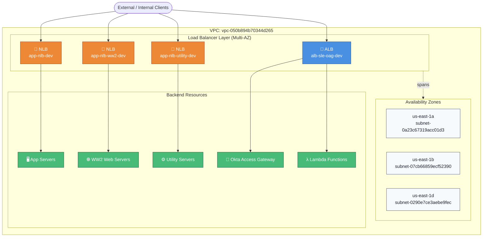
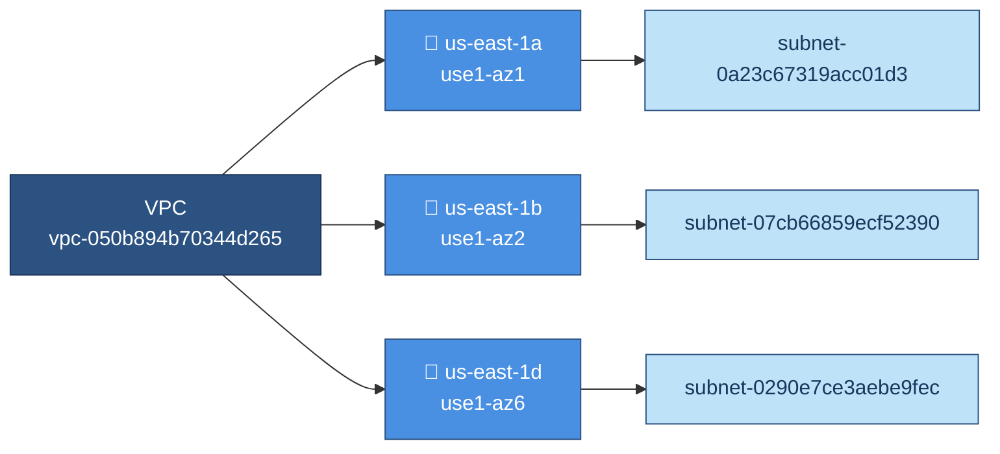
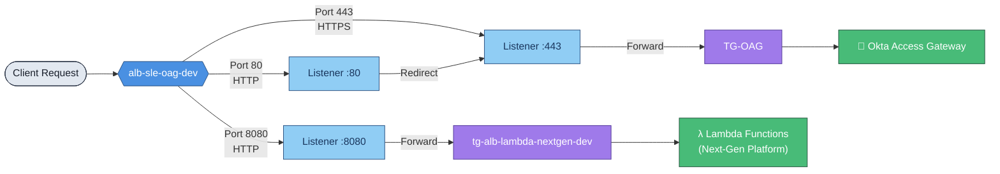
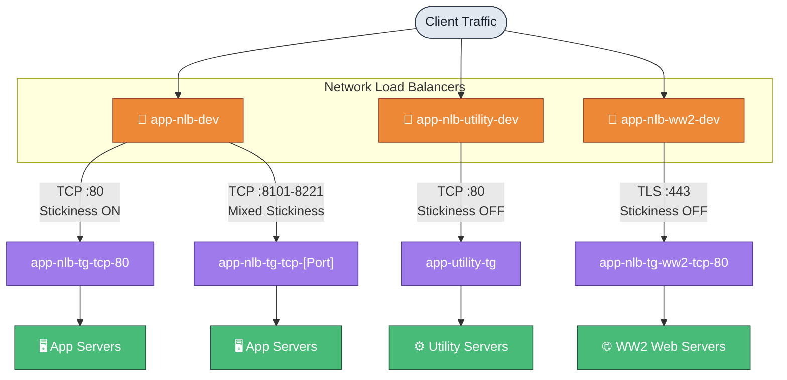
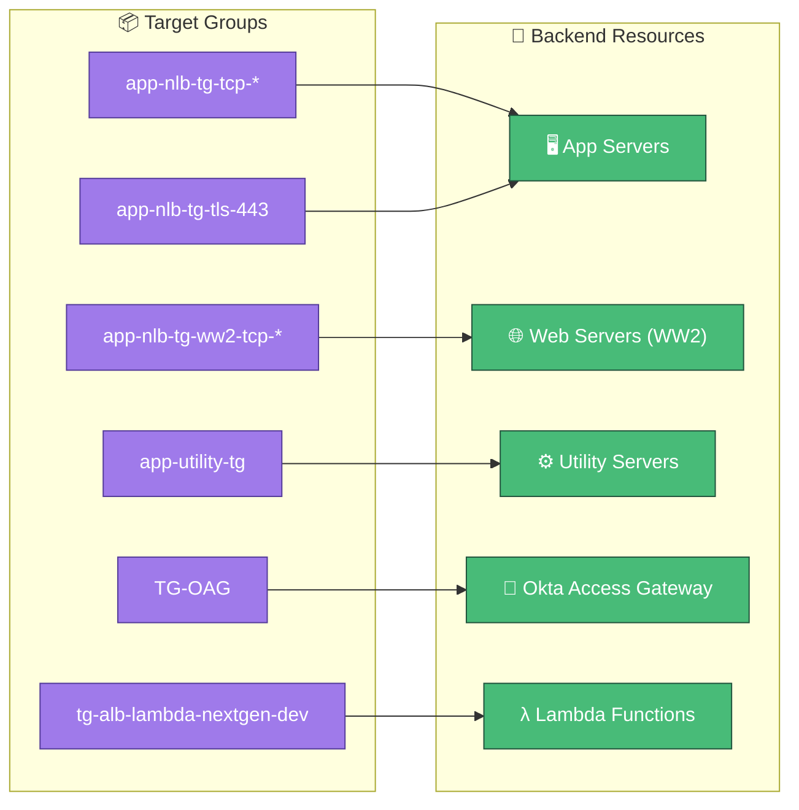
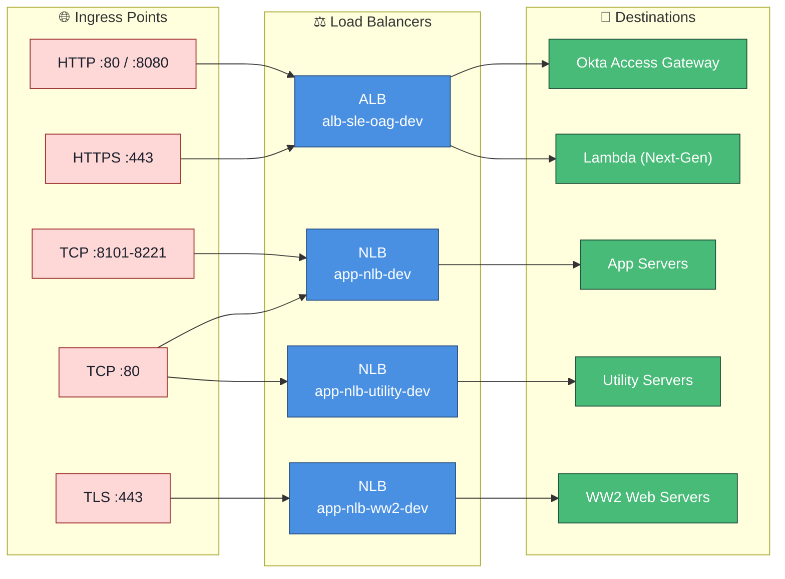

# AWS Load Balancer Architecture

**Development Environment Documentation**

---

## High-Level Architecture

---

## 1. Network Mapping Overview

| VPC ID |
|--------|
| `vpc-050b894b70344d265` |

### Availability Zone Subnet Mapping

| Availability Zone | Subnet ID | AZ ID |
|-------------------|-----------|-------|
| us-east-1a | `subnet-0a23c67319acc01d3` | use1-az1 |
| us-east-1b | `subnet-07cb66859ecf52390` | use1-az2 |
| us-east-1d | `subnet-0290e7ce3aebe9fec` | use1-az6 |

---

## 2. Application Load Balancer: `alb-sle-oag-dev`

| Property | Value |
|----------|-------|
| DNS Name | `internal-alb-sle-oag-dev-1298542252.us-east-1.elb.amazonaws.com` |
| Certificate | `sle-ds11-windward.dqdev.ad` |

### Listener Rule Flow

### Listener Rules

| Port | Protocol | Action | Target Group |
|------|----------|--------|--------------|
| 80 | HTTP | Redirect | HTTPS:443 |
| 8080 | HTTP | Forward | `tg-alb-lambda-nextgen-dev` |
| 443 | HTTPS | Forward | `TG-OAG` |

---

## 3. Network Load Balancers

### `app-nlb-dev`

| Port | Protocol | Target Group | Stickiness |
|------|----------|--------------|------------|
| 80 | TCP | `app-nlb-tg-tcp-80` | On |
| 8101-8221 | TCP | `app-nlb-tg-tcp-[Port]` | Mixed |

### `app-nlb-utility-dev`

| Property | Value |
|----------|-------|
| DNS Name | `app-nlb-utility-dev-f1fb2db12773ee67...` |

| Port | Protocol | Target Group | Stickiness |
|------|----------|--------------|------------|
| 80 | TCP | `app-utility-tg` | Off |

### `app-nlb-ww2-dev`

| Property | Value |
|----------|-------|
| Certificate | `sle-ds11-config-windward.dqdev.ad` |

| Port | Protocol | Target Group | Stickiness |
|------|----------|--------------|------------|
| 443 | TLS | `app-nlb-tg-ww2-tcp-80` | Off |

---

## 4. Target Group Definitions

Mapping of target groups to backend resource types.

| Target Group Pattern | Backend Type | Description |
|----------------------|--------------|-------------|
| `app-nlb-tg-tcp-*` | App Servers | Primary application instances for TCP traffic. |
| `app-nlb-tg-ww2-tcp-*` | Web Servers | Dedicated WW2 web instances. |
| `app-nlb-tg-tls-443` | App Servers | App instances for encrypted NLB traffic. |
| `app-utility-tg` | Utility Servers | Infrastructure support and utility services. |
| `TG-OAG` | Okta Access Gateway | Access management gateway servers. |
| `tg-alb-lambda-nextgen-dev` | Lambda Functions | Serverless functions for the next-gen platform. |

---

## Summary: Traffic Path Quick Reference

---

*Document generated on May 7, 2026 | AWS Cloud Engineering*
